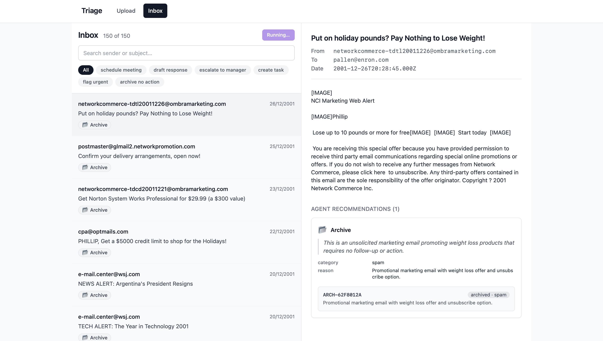
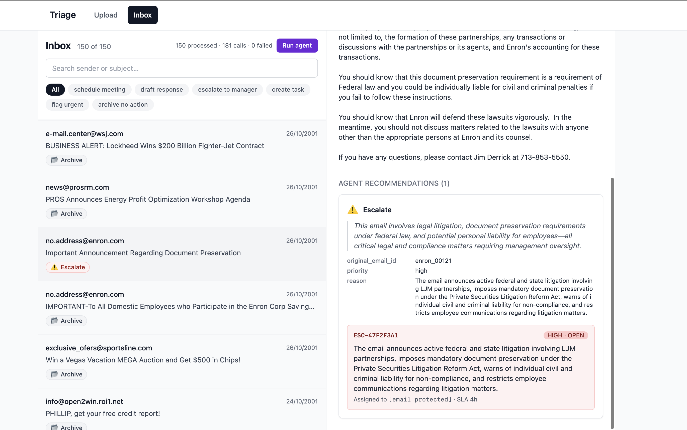
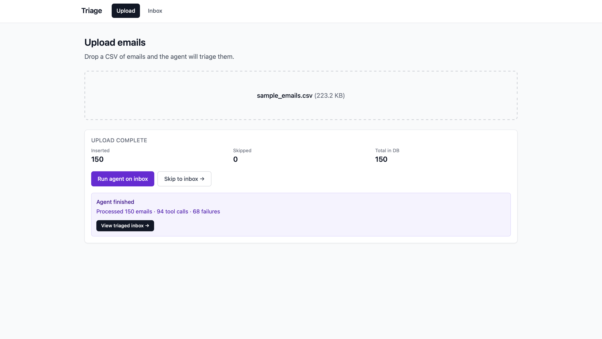

# AI Email Triage Assistant

A full-stack application that uses Anthropic's Claude with tool-use to triage inbound emails. Upload a CSV of emails, the agent reads each one, picks one or more of six tools (schedule meeting, draft reply, escalate, create task, flag urgent, archive), and the UI renders the recommendations as actionable cards that can be "executed" against a mocked backend.

Built for the SDE Co-Op technical assignment. The agent layer is real Claude API; the downstream tool execution is mocked and deterministic.

---

## Demo

### Inbox after a full agent run



150 emails sampled from the Enron Corpus, fully triaged by the agent. Every row shows the tool(s) the agent picked. Filter chips narrow the view to any single tool. The "Run agent" button in the header triggers a fresh batch and is safe to re-click — already-triaged emails are skipped via idempotency.

### Tool card with mocked execution result



Clicking an email opens its detail panel. The agent's recommendation is rendered as a tool card with the rationale (in italics, the agent's own one-sentence explanation), the structured arguments, and an Execute button. When clicked, the backend returns a deterministic mocked result rendered in a tool-specific style — calendar cards for meetings, email previews for drafts, red ticket cards for escalations, etc.

### Upload page with agent trigger



Drag-drop a CSV, get a result summary, and trigger the agent from one place. Re-uploads use `INSERT OR REPLACE` so the same CSV can be uploaded repeatedly without duplicates.

---

## Quickstart

### Prerequisites

- **Node.js 20+** and **npm 10+** (`node -v`, `npm -v` to check)
- An **Anthropic API key** — get one at [console.anthropic.com](https://console.anthropic.com/settings/keys). Account needs a few dollars of credit; the full 150-email demo run costs about $0.25 on Haiku or $4 on Opus.

### Setup

```bash
# 1. Clone the repo
git clone https://github.com/ArfathNEU/email-triage-agent.git
cd email-triage-agent

# 2. Install dependencies (npm workspaces — one install covers everything)
npm install

# 3. Configure environment
cp .env.example .env
# Open .env and paste your Anthropic API key into ANTHROPIC_API_KEY=
```

### Run

You need two terminal tabs:

```bash
# Tab 1 — Backend (Express on :3001)
cd apps/api
npm run dev

# Tab 2 — Frontend (Vite on :5173)
cd apps/web
npm run dev
```

Open [http://localhost:5173](http://localhost:5173) in your browser.

### Try it

1. Go to **Upload**
2. Drop `data/sample_emails.csv` (committed in the repo, 150 emails sampled from the Enron Corpus)
3. Click **Upload sample_emails.csv** → 150 emails inserted
4. Click **Run agent on inbox** → wait ~30 sec (Haiku) or ~3 min (Opus)
5. Click **View triaged inbox →** to see the results

The agent is idempotent — re-running on the same emails is safe and will skip work already done.

---

## Architecture
┌──────────────────────────────────────────────────────────────┐
│                        Browser (Vite)                         │
│  ┌─────────────────┐  ┌──────────────────────────────────┐  │
│  │   Upload page   │  │   Inbox (two-pane + filter chips) │  │
│  └─────────────────┘  └──────────────────────────────────┘  │
│                  React Router · TanStack Query                │
└──────────────────────────────────────────────────────────────┘
│
fetch /api/* (Vite proxy)
▼
┌──────────────────────────────────────────────────────────────┐
│                   Express API (apps/api)                      │
│  ┌──────────────┐  ┌──────────────┐  ┌──────────────────┐   │
│  │  /uploads    │  │   /emails    │  │  /agent/run      │   │
│  │  CSV ingest  │  │  list/detail │  │  batch + tools   │   │
│  └──────┬───────┘  └──────┬───────┘  └────────┬─────────┘   │
│         │                 │                    │              │
│         ▼                 ▼                    ▼              │
│  ┌──────────────────────────────────┐  ┌──────────────────┐  │
│  │      better-sqlite3 (triage.db)   │  │  Anthropic SDK   │  │
│  │  emails · tool_calls · executions │  │  tool_use API    │  │
│  └──────────────────────────────────┘  └──────────────────┘  │
└──────────────────────────────────────────────────────────────┘

### Folder layout
email-triage-agent/
├── apps/
│   ├── api/                          # Express + TypeScript backend
│   │   ├── src/
│   │   │   ├── server.ts             # HTTP entry point
│   │   │   ├── env.ts                # dotenv anchored to repo root
│   │   │   ├── db/
│   │   │   │   ├── index.ts          # SQLite connection + schema runner
│   │   │   │   ├── schema.sql        # tables, indexes, FKs
│   │   │   │   └── queries.ts        # typed CRUD wrappers
│   │   │   ├── routes/
│   │   │   │   ├── uploads.ts        # POST /uploads — multer + csv-parse + Zod
│   │   │   │   ├── emails.ts         # GET /emails, GET /emails/:id
│   │   │   │   ├── agent.ts          # POST /agent/run
│   │   │   │   └── tools.ts          # POST /tools/:id/execute
│   │   │   ├── agent/
│   │   │   │   ├── tools.ts          # 6 tool schemas with required rationale
│   │   │   │   ├── prompt.ts         # System prompt
│   │   │   │   └── run.ts            # Batch runner with concurrency + idempotency
│   │   │   └── tools/
│   │   │       └── executors.ts      # Deterministic mocked tool executors
│   │   └── scripts/
│   │       ├── build-sample-csv.ts   # Enron sampler (regex-bucketed for variety)
│   │       ├── test-db.ts            # DB roundtrip smoke test
│   │       └── test-agent.ts         # Agent smoke test
│   └── web/                          # Vite + React + TypeScript + Tailwind
│       └── src/
│           ├── App.tsx               # Routes + nav shell
│           ├── lib/api.ts            # Typed fetch wrapper
│           ├── pages/
│           │   ├── UploadPage.tsx    # Drag-drop + result + agent trigger
│           │   └── InboxPage.tsx     # Two-pane list/detail + filters
│           └── components/
│               └── ToolCallCard.tsx  # Badges + cards + 6 tool result renderers
├── packages/
│   └── shared/                       # Shared TypeScript types (Email, ToolCall...)
├── data/
│   ├── sample_emails.csv             # 150 Enron emails (committed for §7 of spec)
│   └── triage.db                     # SQLite, gitignored, created on first run
├── tsconfig.base.json                # Strict TS config inherited by all workspaces
├── .env.example                      # Copy to .env and fill in
└── package.json                      # npm workspaces root

---

## Key design decisions

### Why this stack

| Choice | Reason |
|---|---|
| **Express + TypeScript** | Familiar to reviewers, minimal magic, full control over middleware and error handling. Stable LTS. |
| **better-sqlite3** | Synchronous (no async juggling for a single-process app), zero config, persists to disk by default. The whole DB is 36 KB before data and ~300 KB with 150 emails triaged. |
| **Vite + React + Tailwind** | Fast HMR, no boilerplate, utility CSS for rapid iteration without losing design coherence. |
| **TanStack Query** | Caching + invalidation built in. The "Run agent" button on the inbox uses `invalidateQueries` so the list refreshes automatically when the run finishes. |
| **npm workspaces** | Single `npm install` at the repo root pulls deps for all workspaces. Shared types in `packages/shared` are imported as `@app/shared` from both frontend and backend with no build step. |
| **Zod** | Runtime validation at HTTP boundaries (`/uploads` row schema). The compile-time types alone aren't enough — CSV inputs from outside the system have to be validated at runtime. |

### Model, provider, and prompt

**Model**: `claude-opus-4-7` for the demo runs, configurable to `claude-haiku-4-5` (or any future Claude model) via the `ANTHROPIC_MODEL` env var. The codebase has no hardcoded model name.

**Provider**: Anthropic's Messages API (`@anthropic-ai/sdk` package), via the native tool-use feature (`tool_choice: { type: "any" }`).

**System prompt** (in `apps/api/src/agent/prompt.ts`):

> You are an email triage assistant for a corporate inbox.
>
> For each email you receive, decide which tool(s) should be invoked to handle it. You MUST call at least one tool per email. You MAY call multiple tools if appropriate — for example, an angry client email might warrant both `escalate_to_manager` and `draft_response`.
>
> Guidelines:
> - Read the email carefully. Notice tone, urgency, and asks.
> - For every tool call, fill in the `rationale` field with one short sentence explaining your choice.
> - Use `schedule_meeting` when a meeting time, call, or sync is being proposed or requested.
> - Use `draft_response` when the email asks a question or expects a written reply.
> - Use `escalate_to_manager` for negative sentiment, complaints, legal/compliance issues, or churn risk.
> - Use `create_task` for explicit action items, follow-ups, or commitments with a deadline.
> - Use `flag_urgent` for time-sensitive emails that need awareness but no specific action yet.
> - Use `archive_no_action` for newsletters, automated notifications, marketing, FYIs.
>
> Do not output any text — only tool calls. Tool selection is the entire response.

The user message for each call is a structured rendering of the email (id, headers, body, with the body truncated to `MAX_EMAIL_BODY_CHARS` = 4000 characters per the spec).

### Forcing the agent to explain itself

Every tool schema includes a required `rationale` field:

```typescript
{
  name: "escalate_to_manager",
  input_schema: {
    type: "object",
    required: ["rationale", "reason", "priority", "original_email_id"],
    properties: {
      rationale: { type: "string", description: "One short sentence..." },
      // ...
    },
  },
}
```

Combined with `tool_choice: { type: "any" }` in the API call, the agent **must** pick a tool, **must** explain why, and returns both in a single structured response. No need for a follow-up call to ask "why did you pick this?" — the explanation comes inline with the tool input, and we strip it out before storing the rest as the tool's arguments.

This is the single most important agent-design choice in the project. Without it, the agent's reasoning is opaque; with it, every recommendation comes with a one-sentence justification rendered as a blockquote in the UI.

### Concurrency, idempotency, and resilience

`apps/api/src/agent/run.ts` does three things to make batch runs robust:

```typescript
const limit = pLimit(concurrency);                    // 5 emails in flight at once

const results = await Promise.all(
  emails.map((email) =>
    limit(async () => {
      const existing = getToolCallsForEmail(email.id);
      if (existing.length > 0) return { ... };        // ① Idempotency: skip done emails
      return triageOne(email);                         // ② Returns {error} instead of throwing
    }),
  ),
);
```

- **Concurrency** (`p-limit`, configurable via `AGENT_CONCURRENCY`): without it, 150 simultaneous Claude calls would either rate-limit or be slow due to Node's event-loop bottleneck. With it, 150 emails complete in ~30 seconds on Haiku.
- **Idempotency**: re-running the agent is a no-op for emails that already have tool calls. The UI's "Run agent" button can be clicked repeatedly without duplicating work.
- **Error isolation**: a single failure (rate limit, content moderation, network) doesn't abort the batch. Failures are collected and reported in the response payload — the assignment §4.2 calls for this explicitly.

### Deterministic mocked executors

The tool executors in `apps/api/src/tools/executors.ts` mock out third-party APIs (calendar, ticketing, email-send, task-tracker) but do so deterministically. Same arguments always produce the same fake IDs:

```typescript
function hash(args: Record<string, unknown>, prefix: string): string {
  const h = createHash("sha256")
    .update(JSON.stringify(args, Object.keys(args).sort()))
    .digest("hex")
    .slice(0, 8)
    .toUpperCase();
  return `${prefix}-${h}`;
}
```

`Object.keys(args).sort()` is the key trick — without sorting, `{a:1, b:2}` and `{b:2, a:1}` would produce different hashes. Sorting makes the hash truly content-based, so reviewers can verify "same input → same output" by clicking Execute multiple times on the same tool call. The backend also caches execution results in the `tool_executions` table, so re-executing a tool call returns the cached row instead of recomputing.

### Per-tool result rendering

Generic JSON dumps look amateur. Every tool gets its own visual treatment in `apps/web/src/components/ToolCallCard.tsx`:

- **Schedule meeting** → blue card with attendees, time, duration (looks like a calendar invite)
- **Draft response** → violet card with To/Subject headers + body in a white box (looks like an email preview)
- **Escalate to manager** → red card with priority pill + SLA hours (looks like a Jira ticket)
- **Create task** → amber card with title + due date + assignee (looks like a task)
- **Flag urgent** → orange card with reason and optional deadline
- **Archive** → grey card with category pill and reason

This is where most of the visual polish lives. The components are ~250 lines total and turn the inbox from "list of API responses" into something that looks like a real product.

---
## What's mocked vs. what's real

The assignment spec calls for mocked tool execution but doesn't say the agent itself must be mocked. The clear value of the project is in the agent layer, so that's real.

| Layer | Real or mocked | Notes |
|---|---|---|
| **CSV ingestion** | Real | multer + csv-parse + Zod validation. Skipped rows are returned to the client with error details. |
| **Database** | Real | SQLite via better-sqlite3, on disk at `data/triage.db`, schema with FKs and indexes. |
| **Agent reasoning** | **Real Claude API** | Each email → one real `messages.create` call with `tool_choice: any` forcing tool selection. |
| **Tool selection** | Real | Whatever Claude decides, the backend stores. |
| **Tool execution** | **Mocked** | `executors.ts` returns deterministic fake IDs. No real calendars are booked, no emails are sent. |
| **UI** | Real | React/TanStack Query, no shortcuts. |

So when a reviewer clicks **Execute** on a tool card and sees a meeting ID `MTG-A3F2C1B8`, the ID is fake — but the decision to call `schedule_meeting` with those specific attendees and that subject line came from Claude reading the email content.

---

## API contract

| Method | Path | Body | Response |
|---|---|---|---|
| `GET` | `/health` | — | `{ status, uptime, timestamp }` |
| `POST` | `/uploads` | `multipart/form-data` with `file` field | `{ inserted, skipped, totalEmailsInDb, errors: [...] }` |
| `GET` | `/emails` | — | `{ emails: Email[] }` |
| `GET` | `/emails/:id` | — | `Email & { toolCalls: ToolCall[] }` |
| `POST` | `/agent/run` | — | `{ processed, toolCallsTotal, failures: [...] }` |
| `POST` | `/tools/:toolCallId/execute` | — | `{ result, cached: boolean }` |

**Note on endpoint naming:** the spec suggests `POST /tools/:toolName/execute`. I chose `POST /tools/:toolCallId/execute` instead because each tool call is a stored agent decision with its own arguments; executing it by its database ID is naturally idempotent (re-executing returns the cached result from `tool_executions`) and prevents the frontend from having to re-send the full argument blob. Functionally equivalent to the spec's suggestion; semantically cleaner.


Frontend hits these via the Vite proxy at `/api/*` → `localhost:3001/*` (path rewritten).

### Tool call shape

```typescript
interface ToolCall {
  id: number;
  emailId: string;
  tool:
    | "schedule_meeting"
    | "draft_response"
    | "escalate_to_manager"
    | "create_task"
    | "flag_urgent"
    | "archive_no_action";
  arguments: Record<string, unknown>;  // Schema varies per tool
  rationale: string;                    // The agent's explanation
  createdAt: string;
}
```

---

## Sample dataset

`data/sample_emails.csv` is 150 emails sampled from the [Enron Email Dataset](https://www.cs.cmu.edu/~enron/) — the canonical real-world email corpus, made public after the company's 2001 collapse.

The sampling script (`apps/api/scripts/build-sample-csv.ts`) walks the entire 500K-email corpus and bucket-samples 25 emails for each of the 6 tool categories using regex patterns on subject and body:

- **schedule_meeting**: matches "meeting", "call", "schedule"
- **draft_response**: matches questions, "could you", "any thoughts"
- **escalate_to_manager**: matches "unacceptable", "complaint", "concerned"
- **create_task**: matches "action item", "deadline", "by EOD"
- **flag_urgent**: matches "urgent", "ASAP", "critical"
- **archive_no_action**: matches "no-reply", "newsletter", "unsubscribe"

This guarantees variety in the sample so all 6 tools get realistic exercise during a demo run. The bucketing is **a sampling aid**, not the agent's classifier — when the agent runs, it makes its own decision per email based on the actual content, and it sometimes disagrees with the bucket (which is correct behavior).

A notable demo moment: during a real Opus run, the agent independently surfaced **7 escalations related to price-index manipulation** — the actual pattern at the heart of the Enron scandal. The agent wasn't told to look for this; it caught it from the rationales available in the emails themselves.

---

## Trade-offs and what's next

Things I would do with more time:

- **Server-Sent Events for live agent progress.** Right now the "Run agent" button blocks until the entire batch finishes (~30s on Haiku). Streaming per-email updates as they complete would feel much more responsive. Backend would push events, frontend would render a live counter.
- **Better data model for tool decisions on the list endpoint.** Currently the inbox fetches all 150 email details up-front to derive the tool badges on each row (one batch of 150 small requests). The cleaner architecture is to expose a `tools: string[]` field on `GET /emails` so the badges come for free with the list, no follow-up fetches needed.
- **Prompt caching.** Anthropic's `cache_control: { type: "ephemeral" }` would cache the system prompt and tool definitions, reducing input cost by ~5-8x on a batch. Each run currently re-sends the same 1500 tokens of context for every email. With caching, the first email writes the cache, the next 149 read from it. This brings the Opus demo cost from $4 down to ~$0.50.
- **Streaming tool execution results.** The mocked executors are instant, but real third-party APIs aren't. The pattern would be: execute call returns `{executionId, status: "pending"}` immediately, then poll or stream the real result. Currently the UI handles only the success/fail/cached cases.
- **Auth.** No authentication of any kind right now. Production would need at least per-user scoping of emails and tool calls.
- **Test coverage.** I wrote ad-hoc smoke scripts (`test-db.ts`, `test-agent.ts`) but didn't add a proper test framework. Vitest for unit tests of the executors and Zod schemas, Playwright for an end-to-end click-through, would be the minimum.
- **Re-execute / edit tool calls from the UI.** Currently each tool call has one mocked execution. A reviewer might want to tweak the agent's draft email before "sending" — would need an editable form before the Execute button.

Things I considered and rejected:

- **A second LLM call to summarize each email.** Not needed. The agent already has the full email in context when it picks a tool; the rationale field captures the summary essence in one sentence at no extra cost.
- **Streaming the LLM response token-by-token.** Tool-use responses are fast enough (1-2 sec) that streaming adds complexity for little UX gain. Streaming would matter for long generations like draft bodies, but those are returned as a single field in `tool_use.input`.
- **A vector DB or RAG layer.** Each email is self-contained and gets its own independent triage decision. No cross-email retrieval is needed for the assignment's scope.

---

## Configuration

All configurable via `.env`:

| Variable | Default | Notes |
|---|---|---|
| `ANTHROPIC_API_KEY` | required | Get one at console.anthropic.com |
| `ANTHROPIC_MODEL` | `claude-opus-4-7` | Switch to `claude-haiku-4-5` for 15x cheaper development |
| `PORT` | `3001` | Backend port |
| `NODE_ENV` | `development` | |
| `DATABASE_PATH` | `./data/triage.db` | Relative to repo root |
| `MAX_EMAIL_BODY_CHARS` | `4000` | Truncation cap on email body before sending to the agent |
| `AGENT_CONCURRENCY` | `5` | How many emails to triage in parallel |

---

## License

MIT